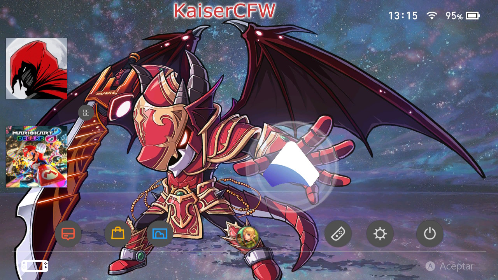
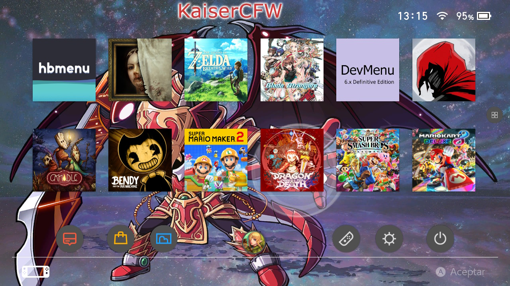
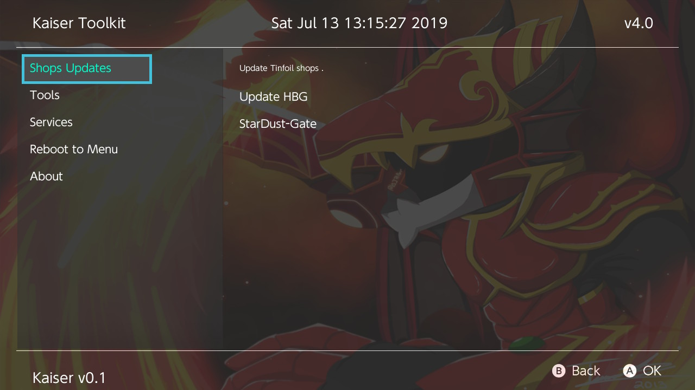

# Kaiser

* A fork of Atmosphere
* Ready to copy and use
* Does not require previous configuration
* With a comfortable interface
* Also add the most basic app to start

Instalación
=============
1.- Descarga el ultimo lanzamiento en [Aqui](https://github.com/StarDustCFW/Kaiser/releases/latest).

2.- Extraer y sobrescribir todo en la micro SD

3.- Injectar [payload-forwarder](https://github.com/StarDustCFW/Kaiser/blob/master/Borrame/Payload-Forwarder.bin?raw=true) en la consola 

  3a.-Si usas R4s como yo, usa este .uf2 en el dongle [CURRENT.UF2](https://github.com/StarDustCFW/Kaiser/blob/master/Borrame/CURRENT.UF2?raw=true)
  
  instrucciones aqui http://bit.ly/2tLBTua

4.- Listo

====================================================

1.- Download the last release in [Here](https://github.com/StarDustCFW/Kaiser/releases/latest)

2.- Extract and overwrite everything in the micro SD

3.- Inject [payload-forwarder](https://github.com/StarDustCFW/Kaiser/blob/master/Borrame/Payload-Forwarder.bin?raw=true) in the console

 3a.-If you use R4s like me, use this .uf2 on the dongle [CURRENT.UF2](https://github.com/StarDustCFW/Kaiser/blob/master/Borrame/CURRENT.UF2?raw=true)
  instructions here http://bit.ly/2tLBTua

4.- Ready

**Credits**

https://github.com/Atmosphere-NX/Atmosphere

https://github.com/Guillem96/argon-nx

Retrogamer 74

D3fau4

PricelessTwo2

And special thanks to Rumba the retrogamer_74 dog

# Forks

https://github.com/StarDustCFW/Atmosphere

https://github.com/StarDustCFW/hekate

https://github.com/StarDustCFW/incognito

https://github.com/StarDustCFW/Lockpick_RCM

Mas informacion Aqui esta mi Discord

# https://discord.io/myrincon

