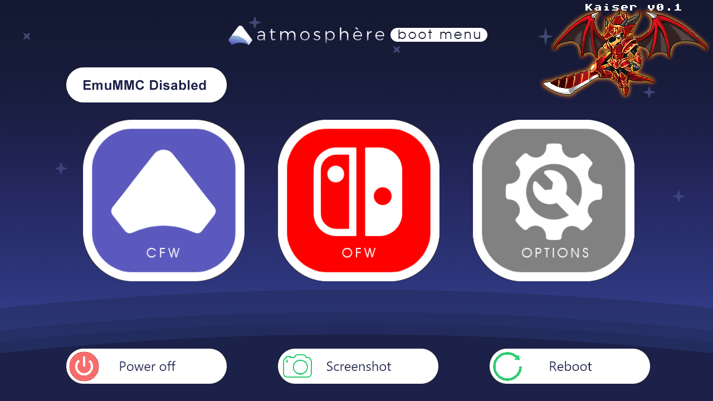

# Kaiser

* A fork of Atmosphere
* Ready to copy and use
* Does not require previous configuration
* With a comfortable interface
* Also add the most basic app to start

# Moved [Here](https://github.com/StarDustCFW/StarDustCFWPack/blob/master/ReadMe.md)
 

**Credits**

https://github.com/Atmosphere-NX/Atmosphere

https://github.com/Guillem96/argon-nx

Retrogamer 74

D3fau4

PricelessTwo2

# Forks

https://github.com/StarDustCFW/Atmosphere

https://github.com/StarDustCFW/hekate

https://github.com/StarDustCFW/incognito

https://github.com/StarDustCFW/Lockpick_RCM

https://github.com/StarDustCFW/StarDustCFWPack

Mas informacion Aqui esta mi Discord

# [MyDiscord](https://discord.io/myrincon)

